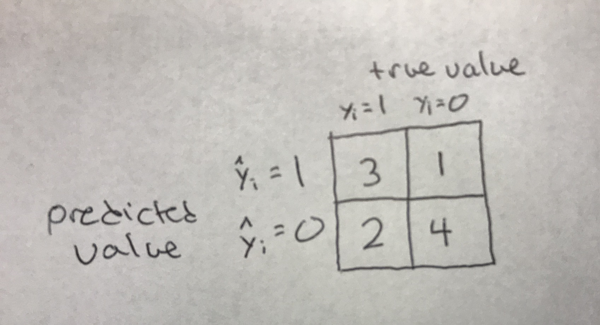
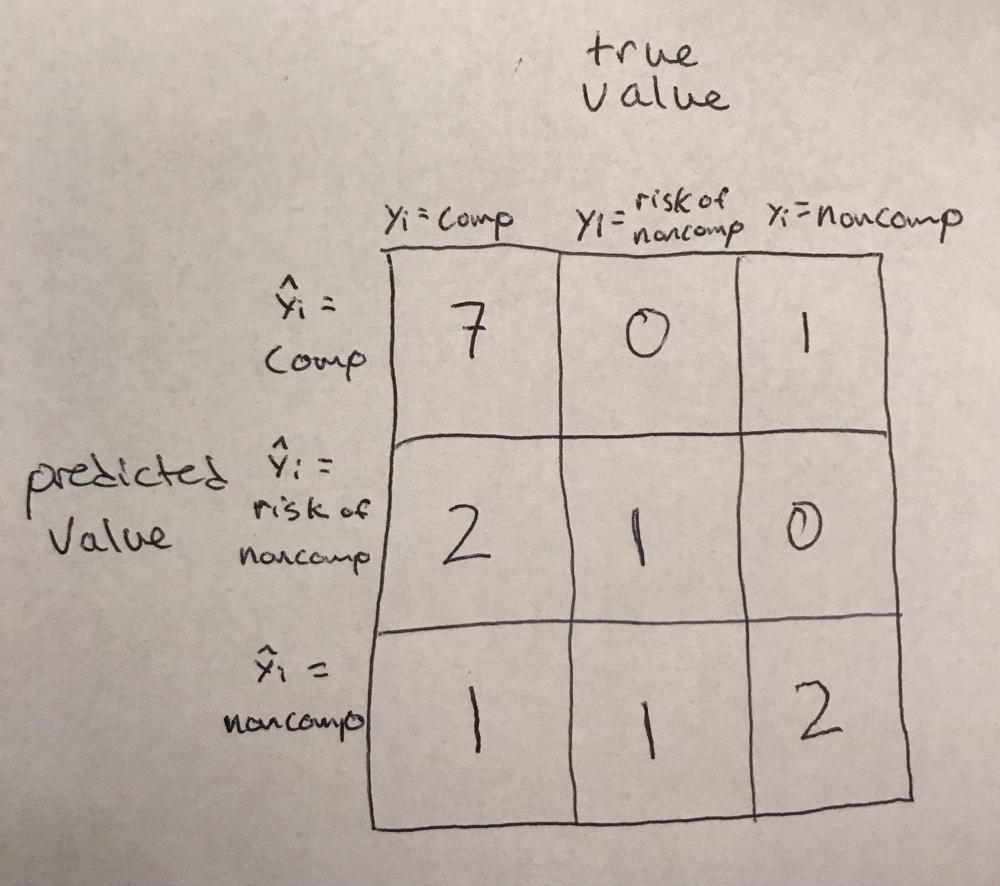

```{r setup, include=FALSE}
knitr::opts_chunk$set(echo = TRUE)
library(knitr)
```

## Exercise 01

$$\begin{eqnarray}
MSE & = & \frac{1}{5}\sum_{i=1}^5(y_i - \hat{y_i})^2 \\
& = & \frac{1}{5}((1-2)^2 + (2-2)^2 + (3-1)^2 + (4-8)^2 + (5-4)^2) \\
& = & 4.4
\end{eqnarray}$$

$$\begin{eqnarray}
RMSE & = & \sqrt{\frac{1}{5}\sum_{i=1}^5(y_i - \hat{y_i})^2} \\
& = & \sqrt{\frac{1}{5}((1-2)^2 + (2-2)^2 + (3-1)^2 + (4-8)^2 + (5-4)^2)} \\
& = & 2.10
\end{eqnarray}$$

$$\begin{eqnarray}
MAE & = & \frac{1}{5}\sum_{i=1}^5|y_i - \hat{y_i}| \\
& = & \frac{1}{5}(|1-2| + |2-2| + |3-1| + |4-8| + |5-4|) \\
& = & 1.6
\end{eqnarray}$$

As compared to MAE, RMSE puts more emphasis on outliers (i.e. predictions with errors of greater magnitude). This is due to the fact that RMSE first squares the difference between the actual and predicted values so gives greater weight to outliers, whereas MAE takes the absolute value of the differences rather than squaring. 

## Exercise 02

### 1. Confusion matrix
```{r, out.width = "50%"}

```

### 2. Accuracy
$$\begin{eqnarray}
Accuracy & = & \frac{True Positive + True Negative}{Total} \\
& = & \frac{3 + 4}{10} \\
& = & 0.7
\end{eqnarray}$$

### 3. Precision
$$\begin{eqnarray}
Precision & = & \frac{True Positive}{True Positive + False Positive} \\
& = & \frac{3}{3 + 1} \\
& = & 0.75
\end{eqnarray}$$

### 4. Recall/Sensitivity
$$\begin{eqnarray}
Precision & = & \frac{True Positive}{True Positive + False Negative} \\
& = & \frac{3}{3 + 2} \\
& = & 0.6
\end{eqnarray}$$

## Exercise 03

### 1. Confusion Matrix
```{r, out.width = "50%"}

```

### 2. Accuracy
$$\begin{eqnarray}
Accuracy & = & \frac{True Positive + True Negative}{Total} \\
& = & \frac{7 + 1 + 2}{15} \\
& = & 0.67
\end{eqnarray}$$

## Exercise 04
In the first scenario, you would be able to achieve an accuracy of .51 by guessing 1 for all values (i.e. correctly predicting all observations that have 1 as their value).

In the second scenario, you would be able to achieve an accuracy of .99 by guessing 0 for every observation (i.e. correctly predicting all observations that have 0 as their value). 

Context matters for accuracy because it does not tell a complete story on its own. For example, your model may be very accurate at predicting one outcome, but terrible at another and this may not be obvious from the overall accuracy metric especially if there is high class imbalance. This is particularly important if you care more about the predictive accuracy for some outcomes than others. 


